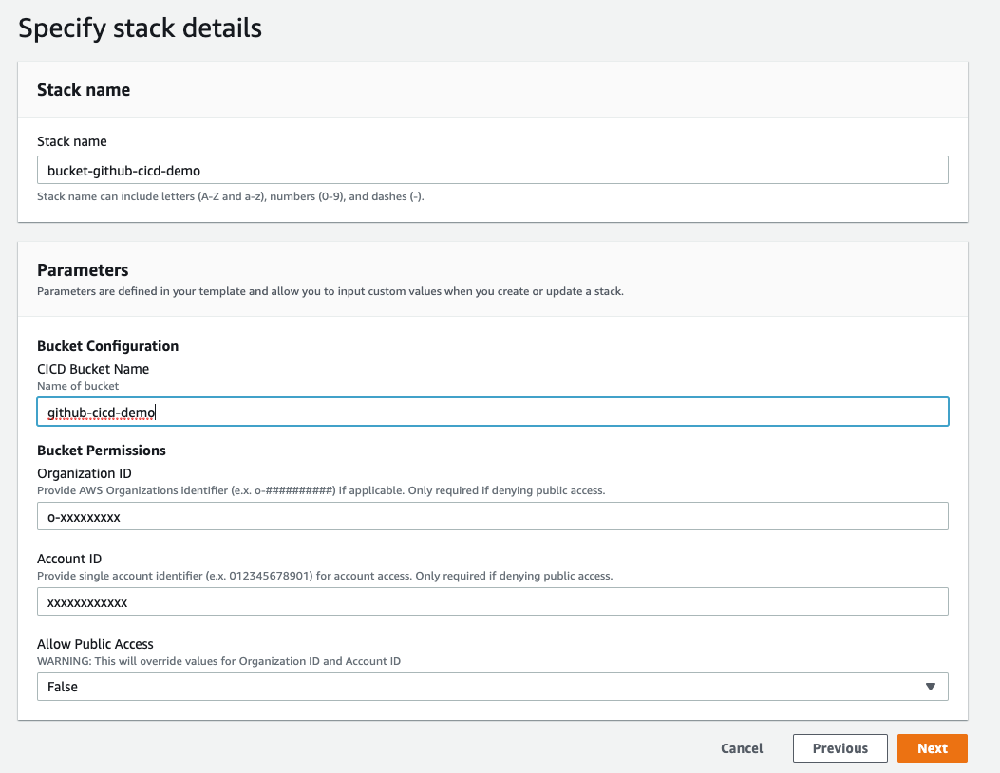
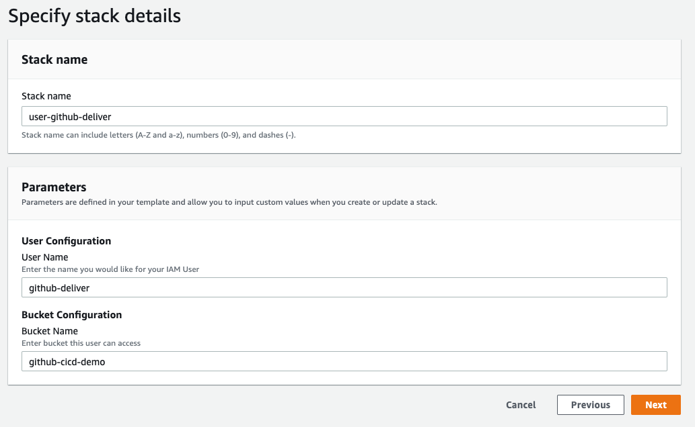
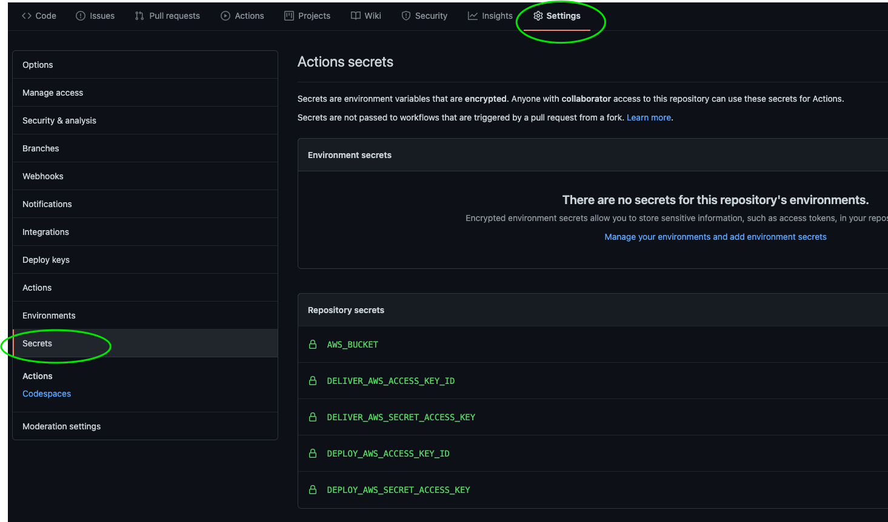

# AWS Automation (CICD) with GitHub Actions

This is a demo providing an example of some workflow checks and templates for the CICD of CloudFormation and Terraform templates to an AWS Account.

## Requirements

Create the following resources in your account

| Resource | Purpose | Deploy Link |
| :--- | :--- | :--- |
| S3 Bucket | Holds resource templates | [](https://us-west-2.console.aws.amazon.com/cloudformation/home?region=us-west-2#/stacks/quickcreate?stackName=bucket-github-cicd&templateURL=https://s3.amazonaws.com/aws-support.tactfulcloud.com/cicd/bucket-github-templates.yml) |
| IAM User | Permissions to put objects in S3 | [](https://us-west-2.console.aws.amazon.com/cloudformation/home?region=us-west-2#/stacks/quickcreate?stackName=user-github-delivery&templateURL=https://s3.amazonaws.com/aws-support.tactfulcloud.com/cicd/user-github-deliver.yml) |
| IAM User | Permission to deploy resources | [](https://us-west-2.console.aws.amazon.com/cloudformation/home?region=us-west-2#/stacks/quickcreate?stackName=user-github-deploy&templateURL=https://s3.amazonaws.com/aws-support.tactfulcloud.com/cicd/user-github-deploy.yml) |

> _**Demo Note:**_ The `Deploy` IAM user template provided in this project is configured with `PowerUserAccess` and can do virtually anything in your environment.

> _**Production Note:**_ In a production environment it would be best to use a [GitHub Action Runner](https://github.com/actions/runner) to prevent storing credentials in your projects.

### S3 Bucket

This [template](requirements/bucket-github-templates.yml) is used to deploy an S3 bucket that has stores templates for AWS ORG, Account or Public Access.

#### Parameters

The following parameters are used:

* Bucket Name
* Public Access - will determine the next two parameters are required. If `true` then Account ID and Org ID are not required as bucket will be open to public for access to template URLs in the CloudFormation Console.
* Organization ID - Required for allowing access to bucket from CloudFormation Console to all accounts in an AWS Organization.
* Account Id - Required to allow access to a specific AWS account.



### IAM Delivery User

This [template](requirements/user-github-deliver.yml) deploys an IAM user that has access to `s3:PutObject` to place templates for access.

This user only has permissions to List, Get, and Put objects in the desired S3 Bucket.

The `Access Key` and `Secret` are delivered to AWS Secrets Manager in the region you deployed the stack.

### IAM Deploy User

This [template](requirements/user-github-deploy.yml) deploys an IAM user that has access `PowerUserAccess`.

This user can do virtually anything in your AWS Account so store credentials wisely and it is recommended to use a GitHub Runner.

The `Access Key` and `Secret` are delivered to AWS Secrets Manager in the region you deployed the stack.



## Resource Cost

The resource/demo and requirement templates provided in this project, when deployed, should not incur any cost.

> _**Note:**_ Any cost incurred subsequent to deployment becomes your responsibility. Deploy at your own risk.

## Workflows

GitHub Action / Workflow must be stored inside a `.github/workflows` directory in your project.

The following Workflows are provided in this project.

### General

**Review**

This workflow is configured to run on all pushes except to the Master/Main branch and will do code quality/linting checks on whatever directory configured in the `env:` variable for each job.

**Deliver**

This workflow is configured to run only on a push to the Master/Main branch and places the templates in the respective directories `(cloudformation / terraform)` in your S3 Bucket.

### CloudFormation

The CloudFormation workflows provided here aid in SCA and the deployment of resources.

**CFN-Review**

This workflow runs on the push to any branch except Master/Main and reviews CloudFormation YAML templates. This argument can be updated to include JSON if required or omitted to review all files in the directory.

**CFN-DEPLOY**

This workflow can be configured to deploy single or multiple CloudFormation Templates directly into the account using the IAM Deploy User.

User permissions for the resources deployed must be properly configured.

This demo user should have access to do virtually any deployment except for IAM resources.

For each template to be deployed, a new step in the job will be required:

```yaml
- name: Deploy {{ AWS RESOURCE }}
    uses: aws-actions/aws-cloudformation-github-deploy@v1.0.3
    with:
        name: {{STACK NAME}}
        template: cloudformation/{{TEMPLATE}}.yml
        no-fail-on-empty-changeset: "1"
```

This workflow is configured to be Manually Triggered but can be configured to run on Merge to Master/Main.

### Terraform

The Terraform workflows provided here aid in the SCA and deployment of Terraform resources using the AWS Provider.

More information on these workflows can be found [here](https://github.com/marketplace/actions/hashicorp-setup-terraform).

**TF-REVIEW**

Initialized Terraform in your runner environment, checks the formatting of your template and validates it.

The Workflow runs on the push to any branch but Main/Master.

**TF-PLAN**

The Workflow runs at the creation of a pull request creating a Terraform `Plan` and outputting that plan to a comment in the pull request to be reviewed.

> Note: Depending on where your place your state file, this workflow or your TF Template may require a few more modifications.

**TF-APPLY**

Configured to be run manually once PR to Main/Master is closed. This can be configured to run on Merge if required. Will apply changes in your environment based on the permissions given to the IAM Deploy User.

## Configuration

The project you are running these workflows in will need to have Secrets configured using the following names if workflows are left unchanged.

Deliver User:

* DELIVER\_AWS\_ACCESS\_KEY\_ID
* DELIVER\_AWS\_SECRET\_ACCESS\_KEY

Deploy User:

* DEPLOY\_AWS\_ACCESS\_KEY\_ID
* DEPLOY\_AWS\_SECRET\_ACCESS\_KEY

Bucket Parameter

* AWS\_BUCKET



## Demo

The CloudFormation and Terraform directory have a single template that deploys an EC2 Security Group via this CICD Process.

Recommended Process:

1. Create a `feature` or `update` branch
2. Make changes to template\(s\) \(i.e. open port\(s\) or allowed CIDRs\)
3. Commit changes to working branch
4. Watch Workflows run under the GitHub Actions Tab of your project
5. If all checks complete successfully, create a PR
6. Review PR and notice comment resulting from the Terraform Plan
7. Review all changes and approve/merge PR.

Depending on how you left the CFN-Deploy and TF-Apply workflows, you may need to select those Workflows under GitHub Actions, and manually run each workflow to deploy the resources in your account.

## Support & Questions

Issues or questions with this process, submit an issue on this project and open a discussion.

Enjoy.
